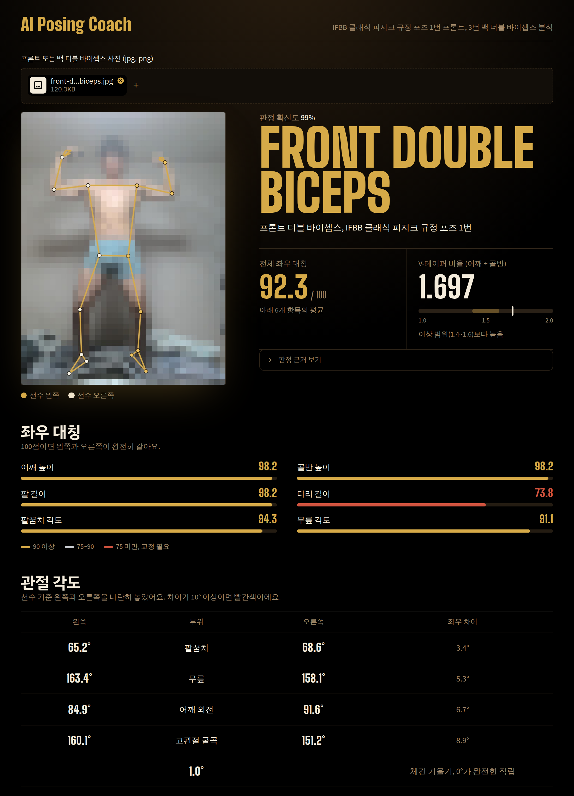

# AI 포징 코치 / AI Posing Coach

<p align="center">
  
  
  
  
</p>

<p align="center">
  <a href="https://ai-posing-coach-kwp2uaqhknf9yzv4cmbcjl.streamlit.app" target="_blank">
    
  </a>
</p>

<p align="center">
  
</p>

---

## 한국어

### 프로젝트 소개

클래식 피지크 선수를 위한 AI 포징 코치입니다.  
포즈 사진을 업로드하면 **MediaPipe**로 신체 관절 33개를 감지하고, 사진이 **프론트 더블 바이셉스인지 백 더블 바이셉스인지 자동으로 판별**한 뒤, V-테이퍼 비율·좌우 대칭성·관절 각도를 계산합니다. 마지막으로 **Claude AI**가 판별된 포즈에 맞춘 한국어 코칭 피드백을 작성합니다.

### 동기

클래식 피지크 심사는 체형 비율과 사이즈, 대칭성, 심미성 등 많은 요소들이 심사 기준이 됩니다. 하지만 통상적으로 심사위원들의 주관적 판단과 성향에 따라 등수가 갈리기도 합니다. 이 프로젝트는 클래식 피지크 규정 포즈 1번(front double biceps)과 3번(back double biceps)에서 선수가 AI 포징 코치를 통해 자세를 개선하고 객관적인 평가를 받음으로써 더 나은 포징과 일관적인 자세를 유지할 수 있도록 돕기 위해 만들었습니다.

### 주요 기능

| 기능 | 설명 |
|---|---|
| **포즈 감지** | MediaPipe Pose Landmarker(Tasks API)로 관절 33개 추출, 몸 관절만 뼈대로 표시 (선수 기준 왼쪽 골드 / 오른쪽 아이보리) |
| **포즈 자동 판별** | 더블 바이셉스 자세인지 확인한 뒤 정면(규정 포즈 1번)·후면(3번)을 판별하고 확신도 표시. 다른 포즈나 애매한 사진은 이유와 함께 분석 거부 |
| **후면 좌우 보정** | 후면 사진에서 관절의 왼쪽·오른쪽 라벨이 선수 기준과 맞도록 자동 정리 |
| **V-테이퍼 비율** | 어깨 너비 / 골반 너비 (이상 범위 1.4–1.6을 게이지로 표시) |
| **좌우 대칭성** | 어깨·골반 높이, 팔·다리 길이, 팔꿈치·무릎 각도 대칭 점수 (0–100) |
| **관절 각도** | 팔꿈치·무릎·어깨 외전·고관절 굴곡을 좌우 나란히 비교하고 차이를 표시, 체간 기울기 |
| **AI 코칭 피드백** | Claude가 지표와 포즈 종류(프론트/백)를 바탕으로 한국어 코치 노트 작성 |

### 포즈 판별 방식

0. **전신 확인**: 어깨부터 발목까지 주요 관절의 신뢰도(visibility)가 낮으면, 잘린 부위를 알려주고 분석하지 않습니다.
1. **더블 바이셉스 자세 확인**: 양 팔꿈치가 어깨 높이 근처에 있는지, 손목이 팔꿈치보다 위에 있는지, 팔이 굽어 있는지 확인합니다.
2. **정면 / 후면 판별**: 세 가지 신호를 가중 합산합니다.
   - 머리 방향: 코가 귀보다 카메라에 가까운가 (MediaPipe의 깊이 값 z)
   - 몸 방향: 코가 어깨보다 카메라에 가까운가
   - 좌우 순서: 선수의 왼어깨가 사진 오른쪽에 있는가
3. 종합 확신도가 기준보다 낮으면 오판 대신 다시 촬영하도록 안내합니다.

판별 기준값은 실제 촬영 사진으로 측정해 정했으며 `src/classify.py` 상단에 모여 있습니다.

### 측정 범위와 한계

- 관절 좌표는 **뼈대 위치**이므로 근육량, 분리도, 컨디셔닝은 평가하지 않습니다.
- V-테이퍼는 어깨 관절(11·12번)과 고관절(23·24번) 사이 비율로, 근육 윤곽이 아닌 골격 기준 비율입니다.
- MediaPipe 좌표는 가로·세로를 각각 0–1로 정규화한 값이므로, 거리·각도는 사진의 세로/가로 비율로 보정한 뒤 계산합니다. 같은 자세라면 사진을 어떻게 잘라도 같은 각도가 나옵니다.

### 기술 스택

| 영역 | 라이브러리 |
|---|---|
| 신체 포즈 추정 | `mediapipe` 1.0 (Tasks API, Pose Landmarker) |
| 이미지 처리 | `opencv` (mediapipe 의존성), `Pillow`, `numpy` |
| 웹 UI | `streamlit` (커스텀 CSS 테마) |
| AI 피드백 생성 | `anthropic` (Claude Opus 4.8) |
| 환경 변수 관리 | `python-dotenv` |
| 테스트 | `pytest` |

### 설치 및 실행

```powershell
# 1. 저장소 클론
git clone https://github.com/seongyeol-code/ai-posing-coach.git
cd ai-posing-coach

# 2. 가상 환경 생성 및 활성화
python -m venv venv
.\venv\Scripts\Activate.ps1      # Windows PowerShell
# source venv/bin/activate       # macOS / Linux

# 3. 의존성 설치
pip install -r requirements.txt

# 4. 환경 변수 설정
# .env 파일을 만들고 Anthropic API 키를 입력합니다.
# ANTHROPIC_API_KEY=sk-ant-...

# 5. 앱 실행
streamlit run app.py
```

브라우저에서 `http://localhost:8501` 로 접속하세요.  
처음 실행할 때 포즈 모델 파일(약 9MB)을 `models/` 폴더에 자동으로 내려받습니다.

```powershell
# 테스트 실행
python -m pytest
```

### 프로젝트 구조

```
ai-posing-coach/
├── app.py                  # Streamlit 앱 진입점 (파이프라인 연결)
├── src/
│   ├── pose.py             # MediaPipe 관절 감지, 모델 다운로드, 뼈대 그리기
│   ├── classify.py         # 더블 바이셉스 확인 + 프론트/백 판별, 후면 좌우 보정
│   ├── metrics.py          # 관절 좌표 → V-테이퍼·대칭·관절 각도 계산
│   ├── feedback.py         # 지표 + 포즈 종류 → Claude API 코치 노트
│   └── ui.py               # 화면 디자인 (CSS, HTML 조각)
├── tests/
│   ├── test_metrics.py     # metrics.py 단위 테스트
│   └── test_classify.py    # classify.py 단위 테스트
├── .streamlit/config.toml  # 테마 색상
├── packages.txt            # Streamlit Cloud용 시스템 라이브러리
├── requirements.txt
├── models/                 # 포즈 모델 (자동 다운로드, git 미포함)
└── .env                    # ANTHROPIC_API_KEY (git 미포함)
```

---

## English

### Project Overview

An AI posing coach for Classic Physique athletes.  
Upload a pose photo and the app detects 33 body landmarks with **MediaPipe**, **automatically determines whether it is a Front or Back Double Biceps**, computes key metrics (V-taper ratio, bilateral symmetry, joint angles), and generates Korean-language coaching notes with **Claude AI**, tailored to the detected pose.

### Motivation

Classic physique judging encompasses numerous criteria including physique proportions, muscle size, symmetry, and aesthetics. However, placements often vary depending on the subjective judgment and personal tendencies of individual judges.
This project was created to help competitors improve their posing and maintain consistent form by receiving AI-powered coaching feedback on the two mandatory poses in classic physique competition — Pose 1 (Front Double Biceps) and Pose 3 (Back Double Biceps) — enabling athletes to refine their technique and receive objective, data-driven evaluations.

### Key Features

| Feature | Description |
|---|---|
| **Pose Detection** | Extracts 33 landmarks with MediaPipe Pose Landmarker (Tasks API) and draws the body skeleton (athlete's left in gold, right in ivory) |
| **Automatic Pose Classification** | Checks for a double biceps pose, then classifies front (Pose 1) vs. back (Pose 3) with a confidence score. Other poses and ambiguous photos are rejected with a reason |
| **Back-View Side Correction** | Relabels left/right landmarks on back-view photos so they match the athlete's own sides |
| **V-Taper Ratio** | Shoulder width ÷ hip width, shown on a gauge with the ideal 1.4–1.6 band |
| **Bilateral Symmetry** | Scores (0–100) for shoulder/hip height, limb lengths, and elbow/knee angles |
| **Joint Angles** | Elbows, knees, shoulder abduction, and hip flexion compared side by side with the difference, plus trunk lean |
| **AI Coaching Feedback** | Claude writes Korean coaching notes from the metrics and the detected pose |

### How Classification Works

0. **Full-body check**: if key joints from shoulders to ankles have low visibility, the app names the cut-off parts and stops.
1. **Double biceps check**: both elbows near shoulder height, wrists above elbows, arms bent.
2. **Front vs. back**: a weighted sum of three signals.
   - Head direction: is the nose closer to the camera than the ears? (MediaPipe depth z)
   - Body direction: is the nose closer to the camera than the shoulders?
   - Side order: is the athlete's left shoulder on the right side of the image?
3. If the combined confidence is below the threshold, the app asks for a retake instead of guessing.

Thresholds were measured on real photos and live at the top of `src/classify.py`.

### Scope and Limitations

- Landmarks are **skeletal joint positions**, so muscle size, separation, and conditioning are not evaluated.
- The V-taper uses shoulder joints (11, 12) and hip joints (23, 24), so it is a skeletal ratio rather than a muscle-contour ratio.
- MediaPipe normalizes x and y to 0–1 independently, so distances and angles are corrected by the image aspect ratio before computing. The same pose yields the same angles regardless of how the photo is cropped.

### Tech Stack

| Domain | Library |
|---|---|
| Body pose estimation | `mediapipe` 1.0 (Tasks API, Pose Landmarker) |
| Image processing | `opencv` (mediapipe dependency), `Pillow`, `numpy` |
| Web UI | `streamlit` (custom CSS theme) |
| AI feedback generation | `anthropic` (Claude Opus 4.8) |
| Environment management | `python-dotenv` |
| Testing | `pytest` |

### Installation & Usage

```bash
# 1. Clone the repository
git clone https://github.com/seongyeol-code/ai-posing-coach.git
cd ai-posing-coach

# 2. Create and activate a virtual environment
python -m venv venv
.\venv\Scripts\Activate.ps1      # Windows PowerShell
# source venv/bin/activate       # macOS / Linux

# 3. Install dependencies
pip install -r requirements.txt

# 4. Set up environment variables
# Create a .env file with your Anthropic API key:
# ANTHROPIC_API_KEY=sk-ant-...

# 5. Run the app
streamlit run app.py
```

Open `http://localhost:8501` in your browser.  
On first run, the pose model (~9 MB) is downloaded automatically into `models/`.

```bash
# Run tests
python -m pytest
```

### Project Structure

```
ai-posing-coach/
├── app.py                  # Streamlit entry point (pipeline wiring)
├── src/
│   ├── pose.py             # MediaPipe detection, model download, skeleton drawing
│   ├── classify.py         # Double biceps check + front/back classification, back-view side correction
│   ├── metrics.py          # Landmarks → V-taper, symmetry, joint angles
│   ├── feedback.py         # Metrics + pose type → Claude API coaching notes
│   └── ui.py               # Visual design (CSS, HTML fragments)
├── tests/
│   ├── test_metrics.py     # Unit tests for metrics.py
│   └── test_classify.py    # Unit tests for classify.py
├── .streamlit/config.toml  # Theme colors
├── packages.txt            # System libraries for Streamlit Cloud
├── requirements.txt
├── models/                 # Pose model (auto-downloaded, not committed)
└── .env                    # ANTHROPIC_API_KEY (not committed)
```

---

## Pipeline

```
Image Upload → MediaPipe Pose Detection → Front/Back Classification → Metric Computation → Claude API → Coaching Notes
```

## License

MIT
